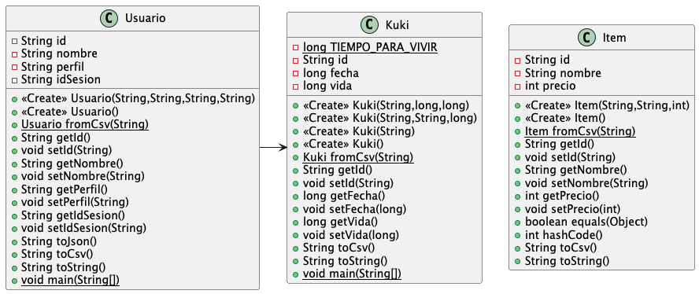
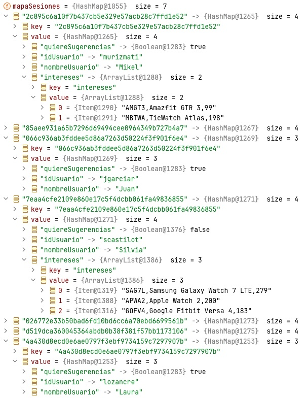
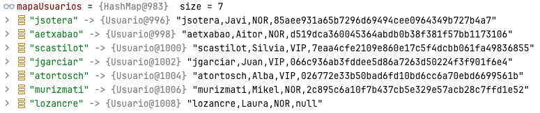
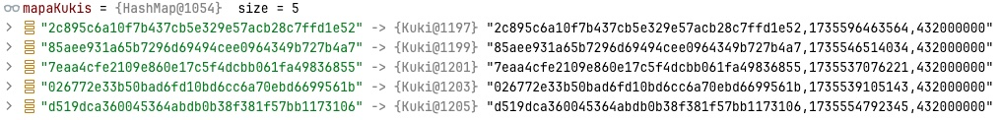
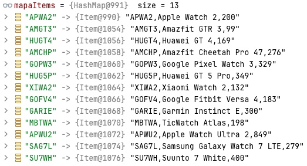
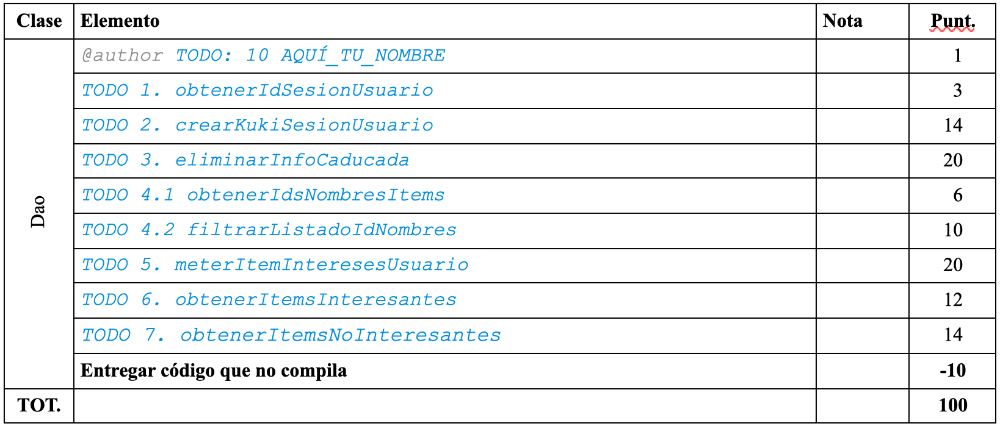

# Kukis

La aplicación Kukis esta inspirada en un sistema de gestión de Cookies para una aplicación web. Para comprender mejor el funcionamiento de la aplicación se puede consultar la documentación que hay en la carpeta doc.  Todo el código se debe escribir dentro de los métodos definidos que tienen un TODO en la clase Dao.

## Explicación de la app

Un usuario puede tener asociada una Kuki de sesión que tiene un id de tipo hash (SHA-1), una fecha de creación y un tiempo de vida tras el cual no será valida. Por otra parte hay items sobre los cuales los usuarios pueden mostrar interés. A continuación se muestra un diagrama de clases y en la siguiente página valores de ejemplo cargados en los mapas de datos que utiliza la aplicación.



En la aplicación se van a utilizar cuatro mapas para simular la base de datos. Los tres primeros mapas tendrán como clave el atributo id de sus respectivas clases.

```
public static Map<String, Usuario> mapaUsuarios = new HashMap<>();;
public static Map<String, Kuki> mapaKukis = new HashMap<>();
public static Map<String, Item> mapaItems = new HashMap<>();
public static Map<String, Map<String, Object>> mapaSesiones = new HashMap<>();
```

En el mapa de las sesiones la clave será una id de sesión que sirve para ser asociada a una Kuki y un Usuario. El valor será otro mapa de atributos en los que la clave será un nombre que identifica el valor asociado guardado en esa entrada.

En las siguientes imágenes se pueden observar unos valores de ejemplo almacenados en cada uno de los mapas. Se recuerda que al ejecutar la aplicación el mapa de sesiones estará sin datos, no habrá ninguna información guardada asociada a las posibles kukis que se hayan cargado en el método ini. Los datos que se muestran sirven para entender el funcionamiento de este mapa.



La primera kuki de la imagen superior con id 2c895c6a10f7b437cb5e329e57acb28c7ffd1e52 tiene asociada un mapa cuyas entradas indican que quiere sugerencias, que el id de usuario es murizmati y el nombre es Mikel y que tiene una lista de intereses con los items correspondientes a un reloj Amazfit GTR 3 y otro TicWatch Atlas.

Puede haber usuarios que no tengan lista de intereses todavía, pero cuando se les quiera registrar el interés por un item se creará esta entrada que se identificará mediante la clave “intereses”  y tendrá como valor una lista con ese item. Si la lista ya contiene ese item no se debe introducir de nuevo.







En las tres imágenes superiores se pueden observar los datos que se pueden guardar en estos mapas.

## Tareas a realizar

Al ejecutar la aplicación se presenta el menú de la aplicación que ofrece las funciones que se tienen que implementar en la clase Dao. La numeración de los TODO está relacionada con la opción de menú mostrada. Sólo el apartado 4 tiene dos TODOs.

```
####################################################################
#   PROGRAMA  DE  GESTIÓN  DE  KUKIS  DE  SESIONES  DE  USUARIOS   #
####################################################################

1. Obtener id de sesión de un usuario
2. Crear una kuki de sesión para un usuario
3. Eliminar kukis y sesiones caducadas o huerfanas
4. Mostrar el id seguido del nombre de los items
   ordenados alfabéticamente sin repetir filtrados por un texto
5. Introducir un nuevo item en los intereses de un usuario
6. Mostrar el nombre de los items
   sobre los que todos los usuarios tienen interés
   ordenados alfabéticamente sin repetir
7. Mostrar el id y nombre de los items que no interesan a nadie
0. Exit
   Opción [0,7]:
```

### 1. Obtener id de sesión de un usuario

// TODO 1. obtenerIdSesionUsuario

Devuelve el hash con la sesión de usuario asociado a su id. Si el id de usuario no se corresponde con ningún usuario se debe devolver null. Ej. murizmati →  2c895c6a10f7b437cb5e329e57acb28c7ffd1e52, supryo → null.

### 2. Crear una kuki de sesión para un usuario

// TODO 2. crearKukiSesionUsuario

Si el usuario no existe se debe devolver null. Sino se debe crear un nuevo id de sesión  utilizando el método Security.generateRandomId que genera un hash aleatorio. Este id de sesión debe ser asignado al usuario y se debe crear una nueva Kuki utilizando como parámetro de entrada ese id de sesión. La información de esta kuki debe ser recogida en el mapa de kukis. Por otra parte, a partir del id de usuario se puede obtener su nombre. En el mapa de sesiones se debe registrar el idUsuario, el nombreUsuario y quiereSugerencias a true asociado a esa kuki. Ej. Sería el caso de Laura y Juan en las imágenes de los mapas de ejemplo. Finalmente hay que devolver el id de sesión creado.


### 3. Eliminar kukis y sesiones caducadas o huerfanas

// TODO 3. eliminarInfoCaducada

Se deben eliminar todas las entradas del mapa de kukis cuya vida haya expirado (ahora > fecha + vida). El tiempo se mide en ms desde el 1 de enero de 1970 y el instante actual se obtiene con el método System.currentTimeMillis(). Tampoco debe haber constancia de estas kukis en el mapa de sesiones y de usuarios. Para ello hay que eliminar las entradas de las sesiones y poner a null el campo de las sesiones de los usuarios. Este método devuelve la cantidad de ids de  kukis eliminados.

### 4. Mostrar el id seguido del nombre de los items
   ordenados alfabéticamente sin repetir filtrados por un texto

// TODO 4.1. obtenerIdsNombresItems

Se tiene que obtener un listado con los ids seguidos de los nombres de los items ordenados.

```
AMCHP - Amazfit Cheetah Pro 47
AMGT3 - Amazfit GTR 3
APWA2 - Apple Watch 2
APWU2 - Apple Watch Ultra 2
GARIE - Garmin Instinct E
GOFV4 - Google Fitbit Versa 4
GOPW3 - Google Pixel Watch 3
HUG5P - Huawei GT 5 Pro
HUGT4 - Huawei GT 4
MBTWA - TicWatch Atlas
SAG7L - Samsung Galaxy Watch 7 LTE
SU7WH - Suunto 7 White
XIWA2 - Xiaomi Watch 2
```

// TODO 4.2. filtrarListadoIdNombres

El listado se debe filtrar eliminando de la lista las cadenas de texto que no contengan el texto que se pasa como filtro. Se debe devolver true o false dependiendo de si se ha eliminado algún elemento de la lista. Si el filtro es vacío o nulo se debe devolver false y dejar la lista intacta. Por ejemplo, si el filtro es GT el resultado sería el siguiente y devolvería true:

```
AMGT3 - Amazfit GTR 3
HUG5P - Huawei GT 5 Pro
HUGT4 - Huawei GT 4
```

Si el filtro es una cadena vacía o un conjunto de espacios en blanco el método simplemente debería devolver false.


### 5. Introducir un nuevo item en los intereses de un usuario

// TODO 5. meterItemInteresesUsuario

Como se puede ver en la imagen de la segunda página puede haber kukis sin lista de intereses o con algún item como interés en el mapa de sesiones. No habrá items repetidos en una misma lista de intereses, pero el mismo item puede aparecer en distintas listas asociadas a distintas kukis. Si el id del item no se corresponde a ningún item o si la lista de intereses ya contenía ese artículo el método debe devolver false. En caso contrarió tras agregar el item a la lista asociada a la kuki se debe devolver true. Fíjate en la clave “intereses” del ejemplo facilitado como tiene asociado un ArrayList de Items cuya representación textual viene dada por el id, nombre y precio separados por comas.

|Opción 4.|Opción 6.|Opción 7.|
|-----------------|----------------|----------------|
|AMCHP - Amazfit Cheetah Pro 47 | Amazfit Cheetah Pro 47 | APWU2 - Apple Watch Ultra 2 |
|AMGT3 - Amazfit GTR 3 | Amazfit GTR 3 | GARIE - Garmin Instinct E |
|APWA2 - Apple Watch 2 | Apple Watch 2 | HUG5P - Huawei GT 5 Pro |
|APWU2 - Apple Watch Ultra 2 | Google Fitbit Versa 4 | SU7WH - Suunto 7 White |
|GARIE - Garmin Instinct E | Google Pixel Watch 3 | |
|GOFV4 - Google Fitbit Versa 4 | Huawei GT 4 | |
|GOPW3 - Google Pixel Watch 3 | Samsung Galaxy Watch 7 LTE | |
|HUG5P - Huawei GT 5 Pro | TicWatch Atlas | |
|HUGT4 - Huawei GT 4 | Xiaomi Watch 2 | |
|MBTWA - TicWatch Atlas | | |
|SAG7L - Samsung Galaxy Watch 7 LTE | | |
|SU7WH - Suunto 7 White | | |
|XIWA2 - Xiaomi Watch 2 | | |

En la tabla superior se muestra un ejemplo con todos los items (4), los interesantes para todos (6) y los que no interesan a nadie (7). Este ejemplo se corresponde con la imagen del mapa de sesiones de la página 2.


### 6. Mostrar el nombre de los items sobre los que todos los usuarios tienen interés ordenados alfabéticamente sin repetir

// TODO 6. obtenerItemsInteresantes

Si el mapa de sesiones está vació el resultado será una lista vacía. Sino sólo contendrá los items que aparecen en alguna lista, sin repeticiones y ordenados alfabéticamente. Ej. Opción 6 en la tabla superior.

### 7. Mostrar el id y nombre de los items que no interesan a nadie

// TODO 7. obtenerItemsNoInteresantes

Lista con los items que no interesan a nadie. Si el mapa de sesiones está vacío todos los items aparecerán aquí. Si todos los items aparecen en alguna lista de intereses de algún usuario esta lista estará vacía. Ej. Opción 7 en la tabla superior.


## Evaluación




